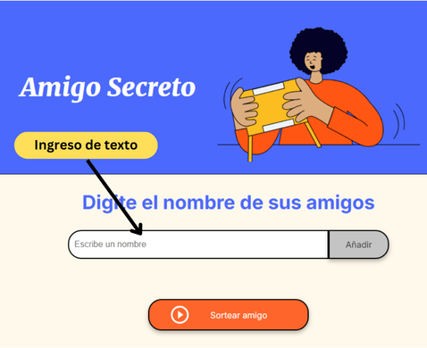

# Sorteo del amigo secreto ALURA
   

   
   

   
Este código es la respuesta al challenge del programa **ONE (Oracle Next Education)** y **Alura**
Etapa Selección: Grupo 8 ONE

El reto consiste en crear código en Javascript para realizar un sorteo del amigo secreto este archivo será invocado desde una archivo HTML

## Funcionalidad:
El código en javascript tiene 3 funciones
- **agregarAmigo** inserta el nombre que se ingrese en el formulario en un arreglo, adicionalmente valida que el formulario no esté vacío y que el nombre no esté registrado en el arreglo, en ambos casos mostrará un mensaje de error.
- **actualizarLista** escribe el contenido del array como una lista debajo del formulario de registro
- **sortearAmigo** sortea uno de los nombres previamente ingresados, previamente hace una validación de que en el arreglo por lo menos se hayan registrado 2 nombres

## Pruébalo:
Mediante este link https://joseacv.github.io/amigo-secreto-alura/ podrás probar el funcionamiento del código, debes ingresar un nombre y luego pulsar el botón añadir, también puedes probar que ocurre si intentas añadir un nombre repetido o dejando el formulario vacío.

Prueba realizar el sorteo sin registrar nombres y luego registrando 2 o más nombres.

## Pantalla inicial:

## Recursos técnicos

**Frontend:** HTML, CSS y Javascript

**Almacenamiento:** efímero en un arreglo

## Mejoras
En una segunda versión se pueden añadir funciones para 
- Registrar el nombre y correo electrónico
- Realizar un sorteo entre todos los nombres registrados para crear parejas
- Notificar a cada uno de los participantes el amigo secreto que le corresponde luego del sorteo.

## Autor
José Cárdenas 
[@joseacv](https://www.github.com/joseacv)
